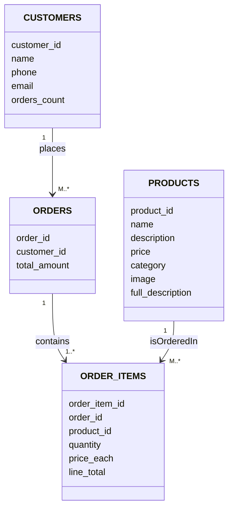

```mermaid
classDiagram
    class CUSTOMERS {
        customer_id
        name
        phone
        email
        orders_count
    }

    class PRODUCTS {
        product_id
        name
        description
        price
        category
        image
        full_description
    }

    class ORDERS {
        order_id
        customer_id
        total_amount
    }

    class ORDER_ITEMS {
        order_item_id
        order_id
        product_id
        quantity
        price_each
        line_total
    }

    CUSTOMERS "1" --> "M..*" ORDERS : places
    ORDERS "1" --> "1..*" ORDER_ITEMS : contains
    PRODUCTS "1" --> "M..*" ORDER_ITEMS : isOrderedIn
```
